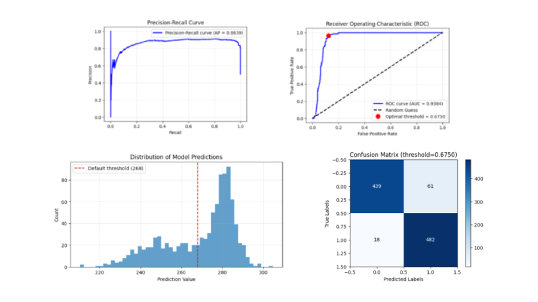

# Cicada GSOC Evaluation Task

Authored by [Mann Acharya](https://github.com/mach-12/)

## Table of Contents

| Section                                                                                                   | Link                                 |
| --------------------------------------------------------------------------------------------------------- | ------------------------------------ |
| [Exploration of Dataset](#exploration-of-dataset)                                                         | [solution.ipynb](solution.ipynb)     |
| [Explaining Baseline Predictions](#explaining-baseline-predictions)                                       | [solution.ipynb](solution.ipynb)     |
| [Show Hidden Kernel Underlying `Lambda` Layer](#show-hidden-kernel-underlying-lambda-layer)               | [solution.ipynb](solution.ipynb)     |
| [Create an Autoencoder CNN Classifier](#create-an-autoencoder-cnn-classifier)                             | [scripts/model.py](scripts/model.py) |
| [Hyperparameter Tuning using Optuna and Tensorboard](#hyperparameter-tuning-using-optuna-and-tensorboard) | [training.ipynb](training.ipynb)     |
| [Training Model with Best Hyperparameters](#training-model-with-best-hyperparameters)                     | [solution.ipynb](solution.ipynb)     |
| [Compare Results to Baseline](#compare-results-to-baseline)                                               | [solution.ipynb](solution.ipynb)     |

## Exploration of Dataset


- The dataset resembles receiver data: label 0 appears as background while label 1 shines as a signal.
- The labels are perfectly balanced at 50-50—quite a rarity compared to real-world scenarios.
- PCA visualizations clearly show that the classes are separable, hinting at distinct underlying patterns.
- Pixel-label correlation plots further confirm the difference between the two types of images.

## Explaining Baseline Predictions



- The initial model outputs were more like regression values rather than crisp classification probabilities.
- Normalizing these outputs was necessary to align them with standard classification metrics.
- This baseline evaluation of **~92%** accuracy set the stage for subsequent improvements in the model.

## Show Hidden Kernel Underlying `Lambda` Layer


- After digging a little deeper, it turns out the `Lambda` layer is simply summing the input pixels. As seen in the graph above, outputs from baseline model and a simple summation kernel are identical.
- Essentially, Label 1 generally exhibits a brighter intensity compared to Label 0, primarily due to the bright spot in the center. Misclassifications occur when Label 0 has a distributed but high intensity or when the central circle in Label 1 is small or of low intensity.
- Still, the baseline function quite effectively captures the key difference between the classes.

## Create an Autoencoder CNN Classifier


## Hyperparameter Tuning using Optuna and Tensorboard

<p align="center">
  
  
</p>

- Optuna streamlined the experimentation with different hyperparameters like `dropout_rate`, `filters`, `kernel_size`, `latent_dim`, `learning_rate`.
- Tensorboard offered a clear, visual representation of each trial, helping pinpoint the best configurations.
- We dump the best experiment parameters in a `.yaml` config.

## Training Model with Best Hyperparameters

<p align="center">
  
  
</p>

- We load the best hyperparameters and train for 100 Epochs
- The model nearly hit 100% accuracy, which is impressive—though it does hint at potential overfitting.

## Compare Results to Baseline


- The final model outperforms the baseline by a significant margin across all key metrics.
- Both visual plots and classification reports highlight the marked improvements.

## Dependencies

```
keras
tensorflow
numpy
pandas
scikit-learn
matplotlib
tensorboard
optuna
optuna-integration[tensorboard]
pyyaml
visualkeras
ipykernel
```
